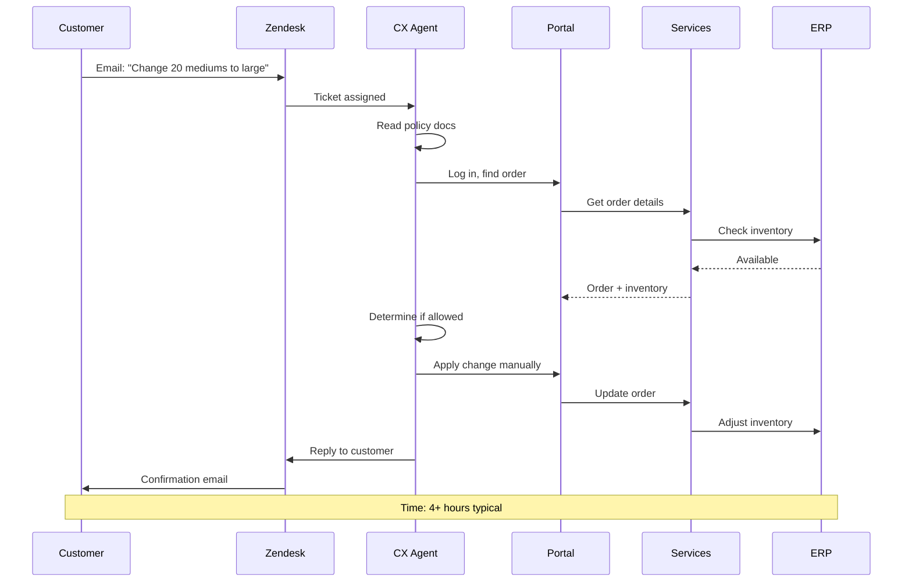
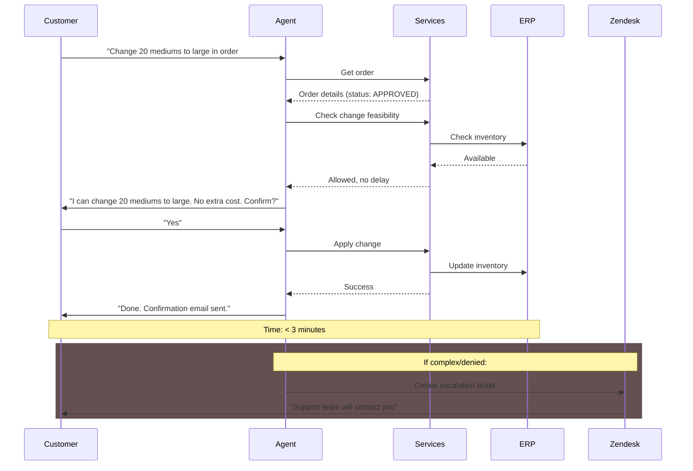
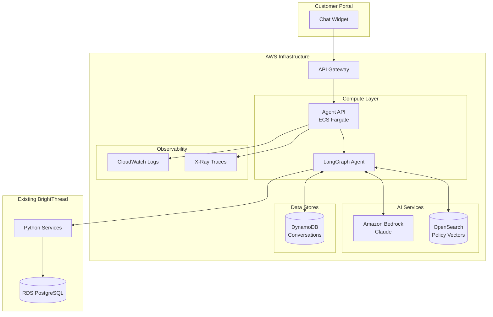
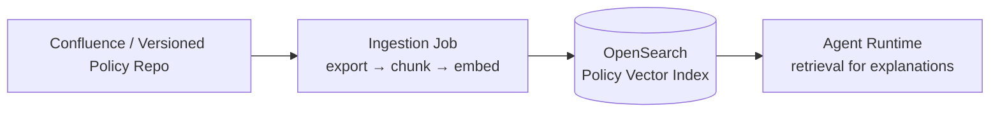
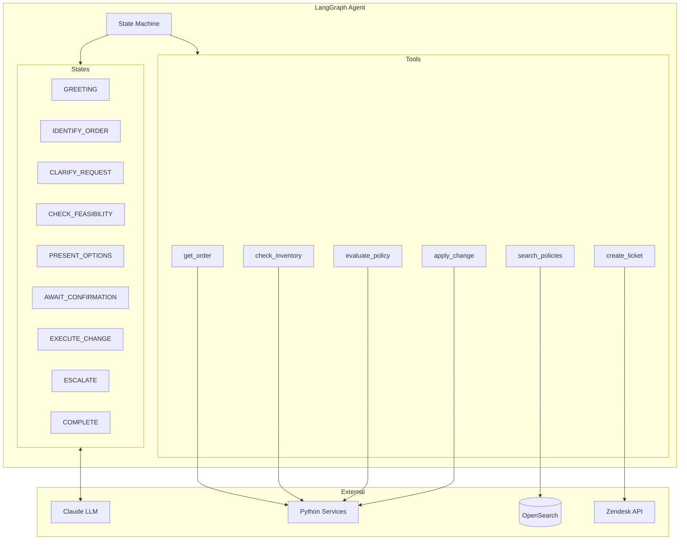
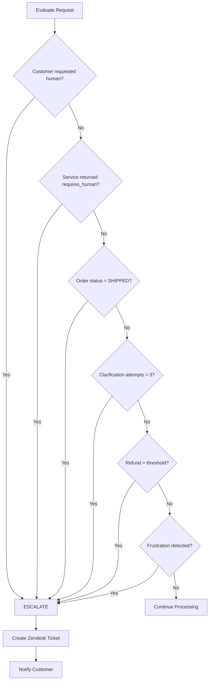
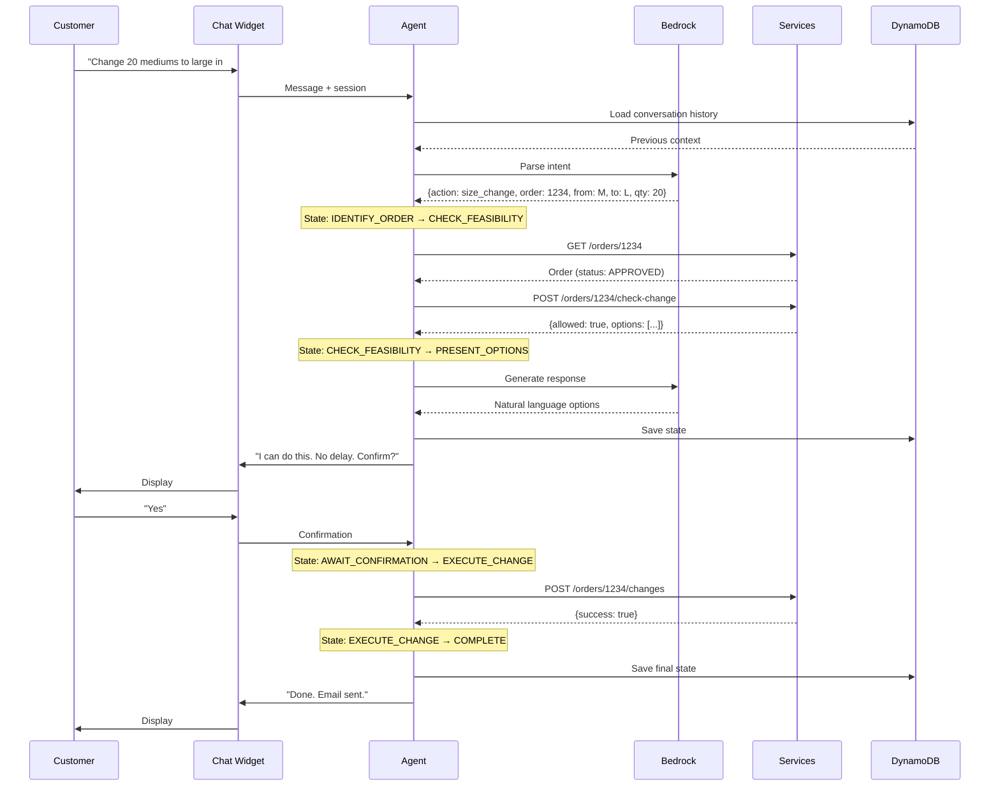
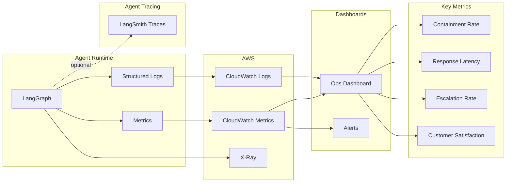

# Architecture Diagrams (Appendix)

This appendix contains additional diagrams used to explore the design in more depth. The **Design Document** intentionally includes only the diagrams required to explain the core approach.

---

## 1. Current State vs. Future State

### 1.1 Current State: Manual Change Request Flow

Today, order changes require manual coordination across multiple systems:

### 1.2 Future State: Agent-Assisted Flow

With the Order Support Agent, routine changes are handled in minutes:

---

## 2. AWS Infrastructure (Compute, Storage, Observability)

### 2.1 Policy Knowledge: Source of Truth + Indexing

Policy documents are authored and versioned in an internal repository (e.g., **Confluence**). The agent runtime uses **OpenSearch vector retrieval** for policy *explanations*; it does not require direct Confluence access.

An offline/scheduled ingestion job:
- Exports the latest policy documents + metadata (including version)
- Chunks and embeds the content
- Upserts chunks + embeddings into OpenSearch

---

## 3. Agent Internal Architecture (Tools + State Machine)

---

## 4. Escalation Decision Tree (Reference)

---

## 5. Data Flow (Happy Path Example)

---

## 6. Observability (Reference)

Operationally, BrightThread should use a **CloudWatch Dashboard + alarms** for real-time health, and optionally add **LangSmith tracing** (especially in dev/staging) to debug LangGraph state transitions, prompts, and tool calls end-to-end.

