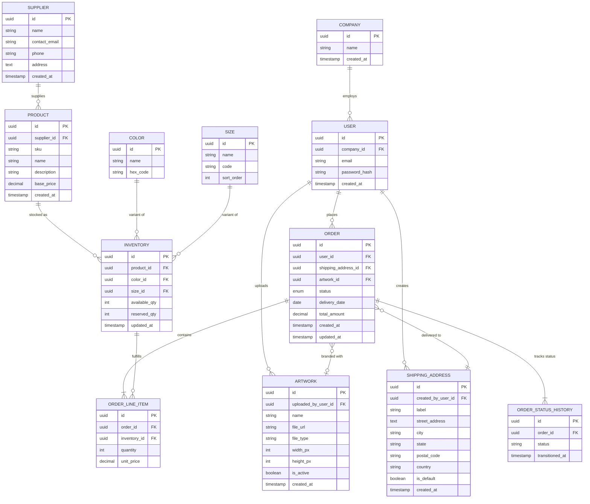

# Data Model

The data model is split across two storage systems: PostgreSQL for relational business data (orders, inventory, products) and DynamoDB for agent conversation state.

---

## 1. Relational Data Model (PostgreSQL)

### Entity Relationship Diagram



---

### Entity Descriptions

#### Supplier

Vendors who supply products to BrightThread.

| Field | Type | Description |
|:------|:-----|:------------|
| `id` | UUID | Primary key |
| `name` | String | Supplier company name |
| `contact_email` | String | Primary contact email |
| `phone` | String | Contact phone number |
| `address` | Text | Supplier address |
| `created_at` | Timestamp | Record creation date |

#### Product

Apparel items available for order.

| Field | Type | Description |
|:------|:-----|:------------|
| `id` | UUID | Primary key |
| `supplier_id` | UUID | Foreign key to Supplier |
| `sku` | String | Stock keeping unit (unique) |
| `name` | String | Product name |
| `description` | String | Product description |
| `base_price` | Decimal | Base price before customization |
| `created_at` | Timestamp | Record creation date |

#### Color

Available color options for products.

| Field | Type | Description |
|:------|:-----|:------------|
| `id` | UUID | Primary key |
| `name` | String | Color name (e.g., "Navy Blue") |
| `hex_code` | String | Hex color code (e.g., "#001F3F") |

#### Size

Available size options for products.

| Field | Type | Description |
|:------|:-----|:------------|
| `id` | UUID | Primary key |
| `name` | String | Display name (e.g., "Medium") |
| `code` | String | Short code (e.g., "M") |
| `sort_order` | Integer | Display ordering (XS=1, S=2, M=3, etc.) |

#### Inventory

Available stock by product/color/size combination.

| Field | Type | Description |
|:------|:-----|:------------|
| `id` | UUID | Primary key |
| `product_id` | UUID | Foreign key to Product |
| `color_id` | UUID | Foreign key to Color |
| `size_id` | UUID | Foreign key to Size |
| `available_qty` | Integer | Units available for sale |
| `reserved_qty` | Integer | Units reserved for pending orders |
| `updated_at` | Timestamp | Last inventory update |

#### Company

B2B customer organizations.

| Field | Type | Description |
|:------|:-----|:------------|
| `id` | UUID | Primary key |
| `name` | String | Company name |
| `created_at` | Timestamp | Account creation date |

#### Artwork

Logo and artwork assets uploaded by companies for branding orders.

| Field | Type | Description |
|:------|:-----|:------------|
| `id` | UUID | Primary key |
| `uploaded_by_user_id` | UUID | Foreign key to User who uploaded |
| `name` | String | Artwork name (e.g., "Primary Logo", "Event Badge 2025") |
| `file_url` | String | S3 URL to the artwork file |
| `file_type` | String | File format (e.g., "png", "svg", "ai") |
| `width_px` | Integer | Image width in pixels |
| `height_px` | Integer | Image height in pixels |
| `is_active` | Boolean | Whether artwork is available for use |
| `created_at` | Timestamp | Upload timestamp |

#### Shipping Address

Saved delivery addresses for companies.

| Field | Type | Description |
|:------|:-----|:------------|
| `id` | UUID | Primary key |
| `created_by_user_id` | UUID | Foreign key to User who added the address |
| `label` | String | Address nickname (e.g., "HQ", "Warehouse") |
| `street_address` | Text | Street address lines |
| `city` | String | City |
| `state` | String | State/province |
| `postal_code` | String | ZIP/postal code |
| `country` | String | Country code |
| `is_default` | Boolean | Default address for user |
| `created_at` | Timestamp | Record creation date |

#### User

Individual users belonging to a company.

| Field | Type | Description |
|:------|:-----|:------------|
| `id` | UUID | Primary key |
| `company_id` | UUID | Foreign key to Company |
| `email` | String | User email (unique) |
| `password_hash` | String | Bcrypt hashed password |
| `created_at` | Timestamp | User creation date |

#### Order

Bulk orders placed by users.

| Field | Type | Description |
|:------|:-----|:------------|
| `id` | UUID | Primary key |
| `user_id` | UUID | Foreign key to User |
| `shipping_address_id` | UUID | Foreign key to Shipping Address |
| `artwork_id` | UUID | Foreign key to Artwork (nullable) |
| `status` | Enum | `CREATED`, `APPROVED`, `IN_PRODUCTION`, `READY_TO_SHIP`, `SHIPPED` |
| `delivery_date` | Date | Requested delivery date |
| `total_amount` | Decimal | Order total |
| `created_at` | Timestamp | Order placement time |
| `updated_at` | Timestamp | Last modification time |

#### Order Line Item

Individual product lines within an order.

| Field | Type | Description |
|:------|:-----|:------------|
| `id` | UUID | Primary key |
| `order_id` | UUID | Foreign key to Order |
| `inventory_id` | UUID | Foreign key to Inventory (product/color/size) |
| `quantity` | Integer | Number of units |
| `unit_price` | Decimal | Price per unit at time of order |

#### Order Status History

Tracks the history of status transitions for each order, recording when the order entered each state.

| Field | Type | Description |
|:------|:-----|:------------|
| `id` | UUID | Primary key |
| `order_id` | UUID | Foreign key to Order |
| `status` | String | Status value (e.g., `CREATED`, `APPROVED`, `IN_PRODUCTION`, `READY_TO_SHIP`, `SHIPPED`, `CANCELLED`) |
| `transitioned_at` | Timestamp | When the order entered this status |

---

### Relational Model Relationships

| Relationship | Description |
|:-------------|:------------|
| **Supplier → Product** | Suppliers provide multiple products |
| **Product → Inventory** | Products have multiple inventory records (one per color/size) |
| **Color → Inventory** | Colors are variants tracked in inventory |
| **Size → Inventory** | Sizes are variants tracked in inventory |
| **Company → User** | Companies employ multiple users |
| **User → Artwork** | Users upload artwork on behalf of their company |
| **User → Shipping Address** | Users create shipping addresses for their company |
| **User → Order** | Users place orders on behalf of their company |
| **Order → Shipping Address** | Each order ships to one address |
| **Order → Artwork** | Each order may use one artwork for branding (optional) |
| **Order → Line Items** | Each order contains one or more line items |
| **Order → Status History** | Each order has a history of status transitions |
| **Inventory → Line Items** | Line items reference specific inventory (product/color/size) |

---

## 2. DynamoDB Data Model

Conversation state is stored in DynamoDB for fast key-value access, TTL-based retention, and independent scaling from the relational database.

### Tables

#### brightthread-conversations

Stores chat message history between users and the agent.

| Attribute | Type | Key | Description |
|:----------|:-----|:----|:------------|
| `user_id` | String | Partition Key | User identifier |
| `session_id` | String | Sort Key | Unique session identifier |
| `messages` | List | - | Array of message objects |
| `created_at` | String | - | ISO 8601 timestamp |
| `updated_at` | String | - | ISO 8601 timestamp |

**Message Object Structure:**

| Field | Type | Description |
|:------|:-----|:------------|
| `role` | String | `user` or `assistant` |
| `content` | String | Message text |
| `timestamp` | String | ISO 8601 timestamp |

**Sample Record:**

```json
{
  "user_id": "default-user",
  "session_id": "session-0cfadb8c8f6c4dbda06d8979c1fde653",
  "created_at": "2025-12-22T00:25:48.979246+00:00",
  "messages": [
    {
      "role": "user",
      "content": "I need to change 20 of the medium shirts in order #1234 to large size.",
      "timestamp": "2025-12-22T00:25:50.847433+00:00"
    },
    {
      "role": "assistant",
      "content": "Thank you for reaching out to BrightThread!...",
      "timestamp": "2025-12-22T00:25:50.889163+00:00"
    }
  ],
  "updated_at": "2025-12-22T00:25:50.889163+00:00"
}
```

#### brightthread-checkpoints

Stores LangGraph agent state checkpoints for conversation continuity.

| Attribute | Type | Key | Description |
|:----------|:-----|:----|:------------|
| `PK` | String | Partition Key | Session identifier |
| `SK` | String | Sort Key | Checkpoint identifier (format: `#checkpoint#<uuid>`) |
| `checkpoint_id` | String | - | UUID of the checkpoint |
| `checkpoint` | Binary | - | MessagePack-encoded agent state |
| `metadata` | Binary | - | MessagePack-encoded checkpoint metadata |
| `type` | String | - | Serialization format (`msgpack`) |
| `expireAt` | Number | - | TTL timestamp (Unix epoch) |

**Sample Record:**

```json
{
  "PK": "session-d261b32c809b4ab28d3c0e36dbe9b7f8",
  "SK": "#checkpoint#1f0decbb-5f7a-69ac-bfff-2e3cc918ec82",
  "checkpoint_id": "1f0decbb-5f7a-69ac-bfff-2e3cc918ec82",
  "checkpoint": "<binary: msgpack-encoded LangGraph state>",
  "metadata": "<binary: msgpack-encoded metadata>",
  "type": "msgpack",
  "expireAt": 1768954696
}
```

---

## 3. Storage Strategy

| Data | Storage | Rationale |
|:-----|:--------|:----------|
| Business entities (Company, User, Order, Product, Inventory) | PostgreSQL (RDS) | Relational queries, transactional integrity, complex joins |
| Conversation messages | DynamoDB | Simple key-value access by session, append-only |
| Agent checkpoints | DynamoDB | LangGraph native support, TTL for auto-cleanup |

---

## 4. Policy Knowledge (OpenSearch Vector Index)

In production, policy documents are maintained in a **versioned internal repository** (e.g., Confluence). A scheduled/offline ingestion job exports the latest versions, chunks the content, generates embeddings, and upserts to **OpenSearch**. The agent runtime performs vector retrieval to provide *policy explanations* (not enforcement).

### 4.1 Suggested OpenSearch Document Shape (Conceptual)

Each indexed chunk should include enough metadata to support filtering, attribution, and safe upgrades:

```json
{
  "doc_id": "policy-order-change",
  "doc_version": "1.2",
  "source_system": "confluence",
  "source_url": "https://confluence.example/.../policy-order-change",
  "chunk_id": "policy-order-change::1.2::chunk-0007",
  "chunk_text": "Orders in IN_PRODUCTION status are actively being printed...",
  "chunk_heading_path": ["IN_PRODUCTION State", "Detailed Policies"],
  "embedding": [/* vector */],
  "updated_at": "2025-12-22T00:00:00Z"
}
```

### 4.2 Retrieval Usage

- The agent requests top-\(k\) chunks from OpenSearch (optionally filtered by `doc_id`, `doc_version`, or domain tags).
- Retrieved chunks are passed to the LLM as context to **explain** the service’s deterministic decision (allowed/denied/conditional).
