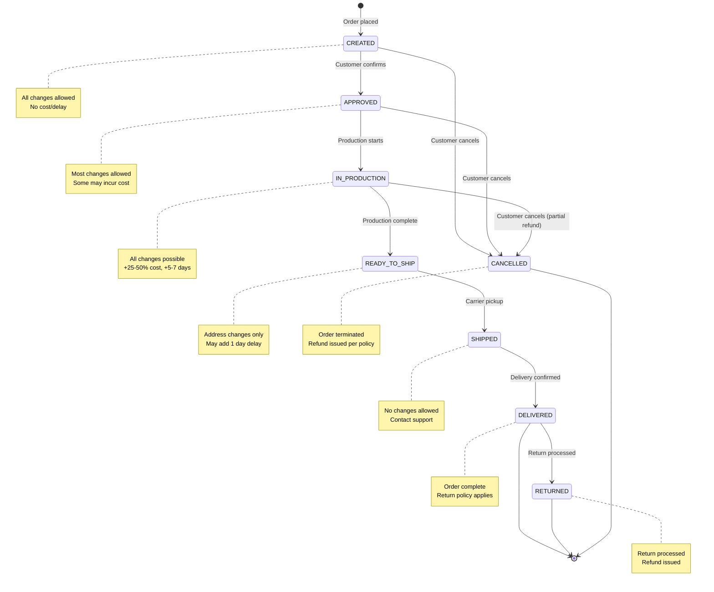

# Order Lifecycle

Orders progress through a series of states from creation to delivery. The policies governing what changes are allowed become increasingly restrictive as the order moves through production and fulfillment.

---

## State Diagram

---

## State Descriptions

| State | Description | Typical Duration |
|:------|:------------|:-----------------|
| **CREATED** | Order has been placed but not yet confirmed | Minutes to hours |
| **APPROVED** | Customer confirmed, awaiting production scheduling | Hours to 1-2 days |
| **IN_PRODUCTION** | Garments are being printed/embroidered | 2-5 days |
| **READY_TO_SHIP** | Production complete, awaiting carrier pickup | 1-2 days |
| **SHIPPED** | Order is in transit to customer | 2-7 days |
| **DELIVERED** | Delivery confirmed by shipping system | Terminal state |
| **RETURNED** | Return processed and refund issued | Terminal state |
| **CANCELLED** | Order cancelled before completion | Terminal state |

---

## Change Policies by State

| State | Quantity | Size | Color | Address | Artwork | Cancel |
|:------|:---------|:-----|:------|:--------|:--------|:-------|
| **CREATED** | ✅ | ✅ | ✅ | ✅ | ✅ | ✅ |
| **APPROVED** | ✅ | ✅ | ✅ | ✅ | ⚠️ +15%, +2d | ⚠️ $25 fee |
| **IN_PRODUCTION** | ⚠️ +25%, +5d | ⚠️ +30%, +5d | ⚠️ +30%, +5d | ✅ $15 | ⚠️ +50%, +7d | ⚠️ 50% refund |
| **READY_TO_SHIP** | ❌ | ❌ | ❌ | ⚠️ $25 fee | ❌ | ❌ Escalate |
| **SHIPPED** | ❌ | ❌ | ❌ | ❌ | ❌ | ❌ |
| **DELIVERED** | ❌ | ❌ | ❌ | ❌ | ❌ | ❌ |
| **RETURNED** | ❌ | ❌ | ❌ | ❌ | ❌ | ❌ |
| **CANCELLED** | ❌ | ❌ | ❌ | ❌ | ❌ | ❌ |

**Legend**: ✅ Allowed | ⚠️ Conditional (cost/delay) | ❌ Not Allowed

---

## Cost and Delay Impact

| State | Allowed Changes | Cost Impact | Delay Impact |
|:------|:----------------|:------------|:-------------|
| **CREATED** | All | None | None |
| **APPROVED** | Quantity, size, color, address | Artwork: +15% | Artwork: +2 days |
| **IN_PRODUCTION** | All (with penalties) | Qty: +25%, Size/Color: +30%, Artwork: +50% | Qty/Size/Color: +5 days, Artwork: +7 days |
| **READY_TO_SHIP** | Address only | Carrier redirect fee ($25) | +1-2 days |
| **SHIPPED** | None | N/A | N/A |
| **DELIVERED** | None | N/A | N/A |
| **RETURNED** | None | N/A | N/A |
| **CANCELLED** | None | N/A | N/A |

---

## Escalation Triggers

Changes that automatically escalate to human CX agents:

| Scenario | State | Reason |
|:---------|:------|:-------|
| Artwork change | IN_PRODUCTION+ | Garments already printed |
| Any change | SHIPPED | Requires carrier coordination |
| Refund > $500 | Any | Financial threshold |
| Split shipment request | Any | Complex logistics |
| Rush order modification | Any | Production scheduling impact |
| Cancellation request | READY_TO_SHIP | Order already packaged |

---

## Agent Behavior by State

### CREATED / APPROVED
- Agent can propose and execute most changes
- Checks inventory availability
- Calculates cost/delay impact
- Requires customer confirmation before execution

### IN_PRODUCTION
- Agent can process all changes but with significant cost/delay penalties
- Quantity increase: +25% cost, +5 days delay
- Size/color changes: +30% cost, +5 days delay (requires new garments)
- Artwork changes: +50% cost, +7 days delay (requires reprint)
- Quantity decrease: No refund for removed items (materials committed)
- Address changes: $15 fee, +1 day delay
- All changes require explicit customer confirmation of cost and delay
- Escalates to human support if customer is dissatisfied

### READY_TO_SHIP
- Agent handles address redirects
- Warns about carrier fees
- Escalates other requests

### SHIPPED
- Agent immediately escalates
- Provides tracking information
- Creates Zendesk ticket with context

### DELIVERED
- Order lifecycle complete
- Agent provides order summary and receipt
- Return policy information available
- No modifications possible

### RETURNED
- Return has been processed
- Agent provides refund confirmation
- No further actions available
- Order archived for records

### CANCELLED
- Order has been terminated
- Agent provides cancellation and refund confirmation
- Inventory has been released back to available
- No further actions available
- Order archived for records

---

## Business Rules (Programmatically Enforced)

### Order Creation Rules
- **Minimum order quantity**: 10 items total across all line items
- **Maximum line item quantity**: 500 items per product/size/color combination
- **Minimum lead time**: 14 days from order creation to delivery date for CREATED orders
- **Approved lead time**: 12 days from approval to delivery date for APPROVED orders
- **Production lead time**: 7 days from production start to delivery date for IN_PRODUCTION orders

### State Transition Rules
- **Sequential progression**: Orders must progress through states in order (no skipping)
- **Valid forward transitions**: CREATED → APPROVED → IN_PRODUCTION → READY_TO_SHIP → SHIPPED → DELIVERED
- **Cancellation transitions**: CREATED → CANCELLED, APPROVED → CANCELLED, IN_PRODUCTION → CANCELLED
- **Optional return transition**: DELIVERED → RETURNED (only within 30-day return window)
- **No backward transitions**: Cannot move from a later state to an earlier state (except to terminal states)
- **Terminal states**: DELIVERED, RETURNED, and CANCELLED are terminal states with no further transitions
- **Transition validation**: System fails fast if invalid transition attempted
- **Delivery confirmation**: SHIPPED → DELIVERED transition triggered by shipping system webhook
- **Return confirmation**: DELIVERED → RETURNED transition triggered when return received and processed

### Inventory Reservation Rules
- **Reservation on creation**: Inventory reserved when order created (available_qty decremented, reserved_qty incremented)
- **Release on cancellation**: Inventory released when order cancelled (available_qty incremented, reserved_qty decremented)
- **Atomic operations**: Inventory updates are transactional to prevent race conditions
- **Insufficient stock**: Order creation fails if requested quantity exceeds available inventory

### Modification Rules by State

#### CREATED State
- All modifications allowed
- No cost impact
- No delivery delay
- Inventory adjustments if quantity/product changes
- Cancellation: Full refund, no penalty

#### APPROVED State
- Quantity changes: Allowed if inventory available
- Size/color changes: Allowed if inventory available
- Address changes: Allowed with no restrictions
- Artwork changes: Allowed but may delay delivery by 1-2 days
- Cost impact: May incur modification fee
- Cancellation: Full refund minus $25 processing fee

#### IN_PRODUCTION State
- Quantity increase: Allowed with +25% cost, +5 days delay (subject to inventory)
- Quantity decrease: Allowed but no refund for removed items (materials committed)
- Size/color changes: Allowed with +30% cost, +5 days delay (requires new garments, subject to inventory)
- Artwork changes: Allowed with +50% cost, +7 days delay (highest penalty, requires reprint)
- Address changes: Allowed with $15 redirect fee, +1 day delay
- All product modifications require explicit customer confirmation
- Cancellation: 50% refund only (materials committed) → transitions to CANCELLED

#### READY_TO_SHIP State
- Address changes only: Allowed with carrier redirect fee
- All other changes: NOT ALLOWED (fail fast)
- Delivery delay: 1 day for address changes
- Cancellation: NOT ALLOWED (escalate to support)

#### SHIPPED State
- No modifications allowed (fail fast)
- All requests escalated to support
- Cancellation: NOT ALLOWED (order in transit)

#### DELIVERED State
- Terminal state - order lifecycle complete (unless returned)
- No modifications allowed (fail fast)
- Reserved inventory released (reserved_qty decremented)
- Return requests initiate DELIVERED → RETURNED transition

#### RETURNED State
- Terminal state - return processed
- No modifications allowed (fail fast)
- Refund issued to original payment method
- Returned items added back to available inventory (if resellable)

#### CANCELLED State
- Terminal state - order terminated before completion
- No modifications allowed (fail fast)
- Refund issued per cancellation policy (varies by previous state)
- Reserved inventory released back to available
- Order archived for records

### Artwork Validation Rules
- **File types**: Only PNG, JPG, SVG, PDF accepted
- **Minimum resolution**: 300 DPI for print quality
- **File size limit**: 50MB maximum
- **Active status**: Only active artworks can be assigned to new orders
- **State restrictions**: Artwork changes not allowed in IN_PRODUCTION+ states

### Refund Eligibility Rules
- **CREATED state**: Full refund, no penalty → transitions to CANCELLED
- **APPROVED state**: Full refund minus processing fee ($25) → transitions to CANCELLED
- **IN_PRODUCTION state**: Partial refund (50% of total) → transitions to CANCELLED
- **READY_TO_SHIP state**: No refund (order complete) → escalate to support
- **SHIPPED state**: Return policy applies (not refund)
- **DELIVERED state**: Return policy applies (30-day window) → transitions to RETURNED
- **RETURNED state**: Refund already issued
- **CANCELLED state**: Refund already issued
