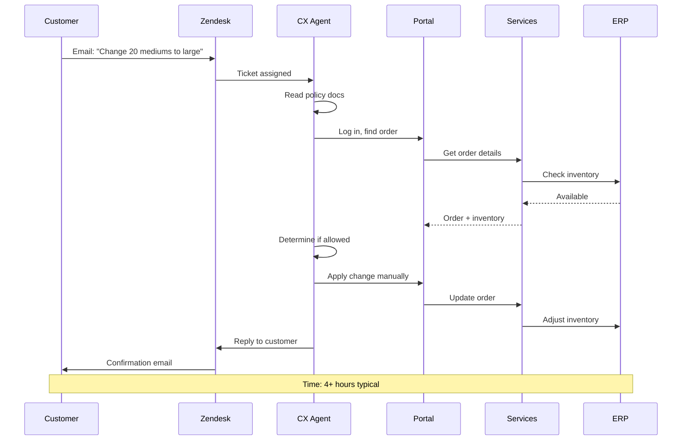
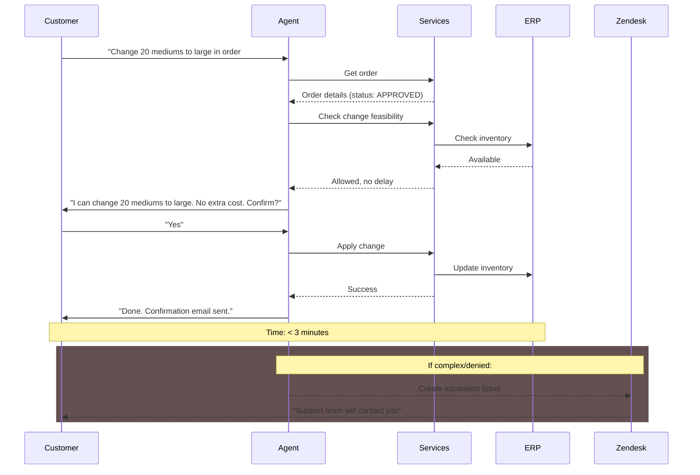
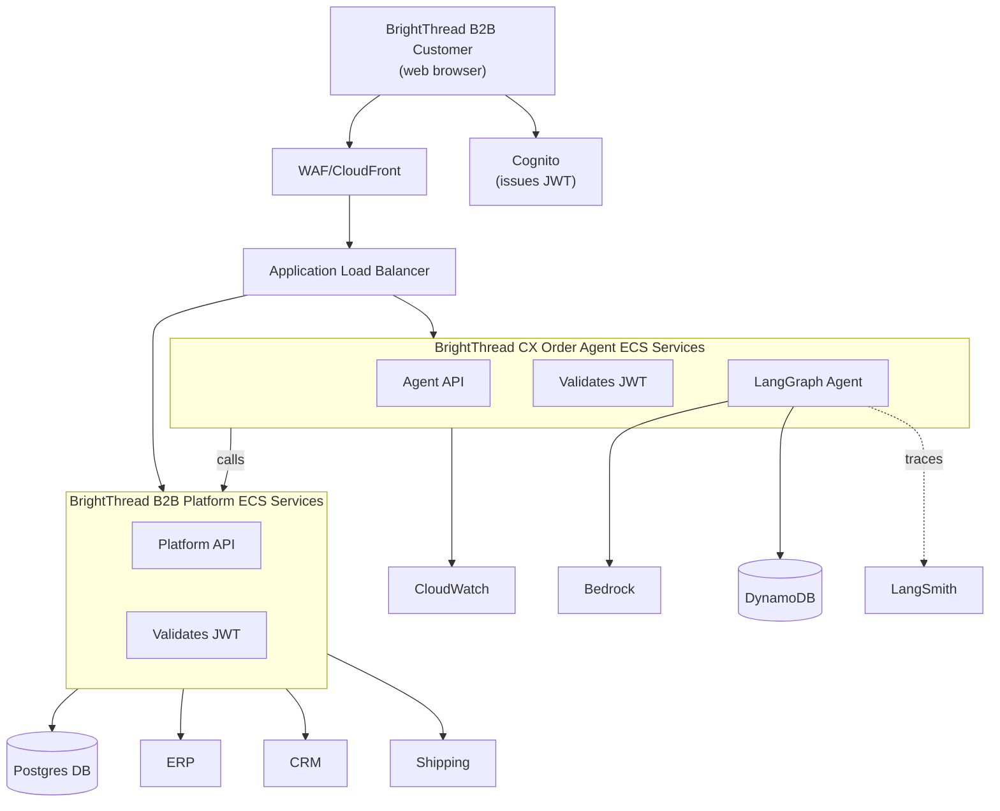
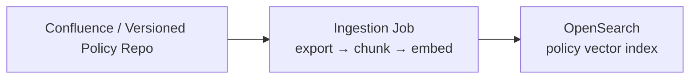
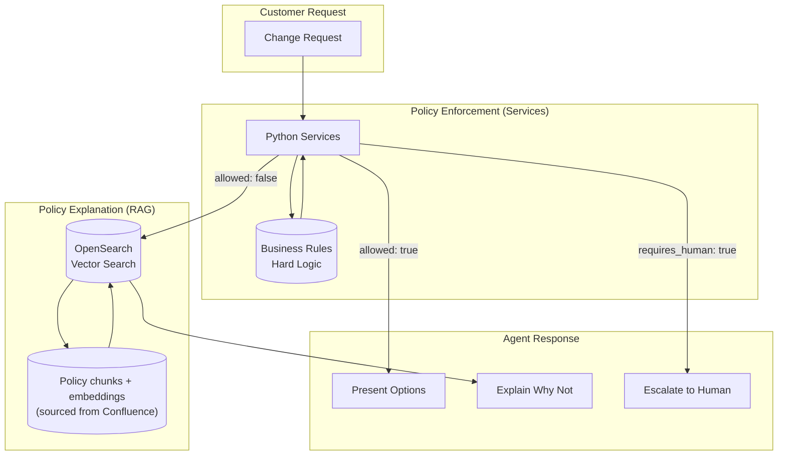
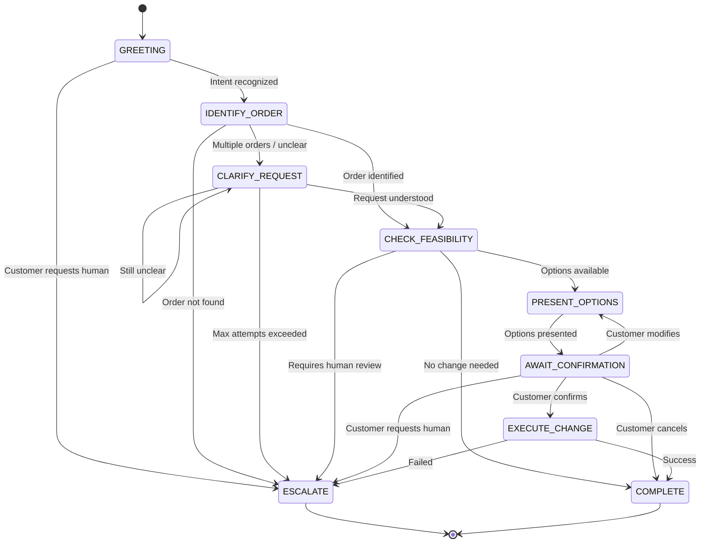

# Order Support Agent: Design Document

## 1. Overview

This document describes the architecture for an AI-powered Order Support Agent that enables BrightThread's B2B customers to request order modifications through natural language conversation.

### Problem Statement

Customers frequently need to modify orders after placement—adjusting quantities, changing sizes, updating addresses, or swapping artwork. Today, these requests require manual handling by CX agents who must interpret requests, check policies, coordinate with operations, and update multiple systems. This creates delays (hours to days) and inconsistent customer experiences.

### Solution

An agentic conversational assistant embedded in the customer portal that:
- Understands natural language change requests
- Validates against order status, inventory, and policies
- Presents options with clear tradeoffs (cost, delay)
- Executes confirmed changes via backend services
- Escalates to human CX agents when appropriate

---

## 2. Design Principles (Quality Attributes)

This design prioritizes being **performant, modular, scalable, reliable, observable, secure, and cost-effective**.

### 2.1 Performance
- Edge caching for static assets via **CloudFront** reduces latency and origin load.
- Minimize LLM calls per user message (prefer deterministic service calls + structured inputs).
- Keep hot paths synchronous and bounded (timeouts; fast failure to escalation when uncertain).
- Use retrieval (RAG) only when needed (policy *explanations*, not enforcement).

### 2.2 Modularity
- Separate **CX Order Agent ECS service** from the **B2B Platform ECS service** with clear API boundaries.
- **Agent as interface**: conversation orchestration only; it delegates business decisions to services.
- **Services as source of truth**: all validation and mutations live in platform services.
- Keep tools thin and typed; avoid embedding business logic in prompts.

### 2.3 Scalability
- **ECS Fargate** services auto-scale horizontally behind an **Application Load Balancer**.
- Stateless agent compute + externalized conversation state (**DynamoDB**) enables safe horizontal scaling.

### 2.4 Reliability & Safety
- ALB health checks + ECS service auto-replacement provide self-healing for failed tasks.
- Explicit state machine to constrain behavior.
- “Fail safe” defaults: if uncertain, ask clarifying questions or escalate.
- No side effects without explicit customer confirmation.

### 2.5 Observability
- Every request and tool call is traceable (correlation IDs; structured logs).
- Metrics for latency, containment, escalation, and error rates.
- Audit trail for state transitions and applied changes.
- CloudWatch **dashboards + alarms** provide an operational view (KPIs, saturation, errors) for both ECS services.
- **LangSmith tracing** (for the LangGraph agent) enables step-by-step debugging of prompts, tool calls, and state transitions.

### 2.6 Security & Compliance
- **WAF** (attached to CloudFront) provides edge filtering (bot/rate limiting/common exploits).
- **Cognito** issues JWTs; both ECS services **validate JWTs** and enforce authorization.
- Least privilege between API → agent → tools → systems.
- Protect PII (retention, access controls, encryption, and redaction where needed).

### 2.7 Cost-Effectiveness
- CloudFront caching reduces origin requests and compute spend.
- Auto-scaling ECS services allow right-sizing to demand.
- Limit RAG + LLM usage through state-machine gating and caching.

---

## 3. Architecture

### 3.1 Production Architecture (High Level)

**Notes:**
- Cognito is **browser-facing** (login + token issuance). Requests to the platform/agent include the JWT (header/cookie), and each service validates it.
- The agent **delegates** order mutations/escalations to platform services to keep business rules centralized and consistent.

### 3.2 Key Components

| Component | Technology | Purpose |
|:----------|:-----------|:--------|
| **Edge** | CloudFront + WAF | Low-latency delivery + protection (rate limiting/bot rules) |
| **Identity** | Cognito | Authentication and JWT issuance |
| **Ingress** | Application Load Balancer | Routes requests to ECS services; health checks |
| **Platform Backend** | ECS (B2B Platform services) | System-of-record reads/writes + integrations (DB/ERP/CRM/shipping) |
| **Agent Backend** | ECS (CX Order Agent service) | Agent API + LangGraph runtime; delegates to platform services |
| **Agent Framework** | LangGraph | Predictable, auditable state machine |
| **LLM** | Claude via Amazon Bedrock | NLU + response generation |
| **Conversation Store** | DynamoDB | Session history + state (TTL retention) |
| **Policy Knowledge** | OpenSearch (vector search) | RAG for policy explanations (retrieved from a versioned policy doc repository) |
| **Observability** | CloudWatch + LangSmith | Dashboards/alarms + agent-level tracing |

### 3.2.1 Policy Document Source + Indexing Pipeline

Policy documents are maintained internally by BrightThread in a **versioned document repository** (e.g., **Confluence**). The agent does **not** depend on direct Confluence access at runtime.

Instead, an offline/scheduled **ingestion job**:
- Exports the latest policy documents (and versions/metadata)
- Chunks the text
- Generates embeddings
- Upserts the chunks + embeddings into **OpenSearch** for vector retrieval

### 3.3 Policy Enforcement vs. Policy Explanation

The design separates **enforcement** (deterministic, service-owned) from **explanation** (LLM/RAG-owned), which improves correctness and auditability.

### 3.4 Agent Design: Graph-Based Workflow

The agent uses **LangGraph's StateGraph** to implement a deterministic workflow rather than an autonomous ReAct-style agent. This is a deliberate architectural choice driven by the requirements of order modification:

**Why a Graph-Based Workflow?**

1. **Mandatory Steps**: Order changes require a strict sequence—identify order → check policy → confirm with customer → execute. The graph **guarantees** this sequence; no path bypasses policy evaluation.

2. **Auditability**: B2B commerce requires accountability. Every state transition is logged, providing a complete audit trail from request to execution.

3. **Predictability**: The same request produces the same flow every time. This is essential when incorrect changes could cost thousands of dollars.

4. **Testability**: Each node can be unit tested in isolation with mocked inputs and expected outputs.

The LLM provides natural language understanding and generation within each node, but the workflow structure is fixed and predictable.

### 3.5 Agent State Machine

The agent operates as a state machine with defined transitions, providing predictability, testability, and auditability:

### 3.6 Reliability & Failure Handling (Implementation Notes)

- **Timeouts and bounded work**: all service calls and LLM calls are time-boxed; failures degrade to clarification or escalation.
- **Idempotency**: change-application endpoints should support idempotency keys to prevent duplicate mutations on retries.
- **Safe retries**: retry reads and checks; avoid retrying side effects without idempotency.
- **Partial failures**: if applying a change touches multiple systems, prefer service-level transactions or compensating actions; if uncertain, escalate.

### 3.7 Observability (Implementation Notes)

- **Structured logs**: include `conversation_id`, `order_id`, `state`, and `tool_name` for every transition/tool call.
- **Tracing**: propagate correlation IDs across CloudFront/ALB → agent ECS service → platform services to support end-to-end debugging.
- **Metrics**: publish latency (p50/p95), containment, escalation, tool error rates, and “human-review required” counts.

#### 3.7.1 CloudWatch Dashboard + Alarms

- **Dashboards**: create a CloudWatch dashboard for “Agent Health” with (at minimum):
  - Request volume and errors by endpoint/state
  - End-to-end latency (p50/p95) and LLM/tool-call latency breakdown
  - Escalation rate and top escalation reasons (e.g., `requires_human_review`, `SHIPPED`, timeouts)
  - External dependency health (services/ERP/shipping) error rates and timeouts
  - DynamoDB read/write throttles, consumed capacity, and latency
  - OpenSearch query latency + error rate (for policy retrieval)
- **Alarms**: alert on error budget burn (5xx), elevated p95 latency, sustained timeouts, and spikes in escalation due to dependency failures.
- **Log Insights**: ensure logs are queryable by `conversation_id`, `order_id`, and correlation ID to reconstruct incidents quickly.

#### 3.7.2 LangSmith Agent Tracing

Use LangSmith to capture agent traces for debugging and evaluation:

- **Trace linkage**: include the correlation ID (and `conversation_id`) in LangSmith trace metadata so you can jump between CloudWatch logs and the full agent trace.
- **Sampling & environments**: enable full tracing by default in dev/staging; use sampling in prod to control cost and data exposure.
- **PII controls**: redact or omit sensitive fields (addresses, emails, tokens) from trace payloads; never include secrets in prompts.

For additional diagrams (flows and observability visuals), see the [Architecture Diagrams Appendix](/appendix/architecture-diagrams/).

For assumptions about BrightThread's existing technology landscape, see the [Assumptions Appendix](/appendix/assumptions/).

---

## 4. Non-Functional Requirements

| Requirement | Target | Notes |
|:------------|:-------|:------|
| **Response latency** | P95 < 5 seconds | LLM calls dominate; acceptable for thoughtful responses |
| **Availability** | 99.5% | Graceful degradation to escalation path |
| **Containment rate** | 70% | Target for agent-resolved vs. escalated |
| **Error rate** | < 1% | Changes applied incorrectly |

For detailed analysis of key architectural decisions, see the [Tradeoffs Appendix](/appendix/tradeoffs/).

---

## 5. Escalation Design

The agent escalates to human CX agents when:

| Trigger | Rationale |
|:--------|:----------|
| Customer requests human | Always honor immediately |
| Service returns `requires_human_review` | Business rules require judgment |
| Order status is `SHIPPED` | Post-shipment changes are complex |
| Clarification attempts > 3 | Don't frustrate the customer |
| Change involves refund > threshold | Financial decisions above agent authority |

**Escalation flow:**
1. Agent creates Zendesk ticket with full transcript + context
2. Agent informs customer of handoff and expected SLA
3. CX agent can review full conversation history

---

## 6. Security & Compliance

| Concern | Approach |
|:--------|:---------|
| **Authentication** | Agent inherits portal session; no separate auth |
| **Authorization** | Agent can only access orders for authenticated customer (enforced by services) |
| **Data access** | All queries go through services; services enforce access control |
| **Audit logging** | All state transitions and tool calls are logged with correlation IDs |
| **PII handling** | Conversation logs follow retention policy (TTL); restrict access; redact where needed |
| **Secrets** | Store API keys/secrets in managed secret storage; never in prompts/logs |

---

## 7. Success Metrics

| Metric | Target | Purpose |
|:-------|:-------|:--------|
| **Containment rate** | 70% | Primary value metric |
| **Time to resolution** | < 3 min (agent) vs. 4+ hrs (email) | Speed improvement |
| **Customer satisfaction** | ≥ 4.0/5.0 | Quality check |
| **Escalation accuracy** | < 10% "agent could have handled" | Calibration |
| **Error rate** | < 1% incorrect changes | Trust metric |

---

## 8. Proof of Concept

A working PoC demonstrates the core agent pattern with a live customer portal:

| Component | Status |
|:----------|:-------|
| React customer portal | ✅ Live |
| LangGraph order support agent | ✅ Functional |
| Claude via Amazon Bedrock | ✅ Integrated |
| Policy handling (full document in context) | ✅ Functional |
| DynamoDB conversation persistence | ✅ Functional |
| FastAPI backend (Lambda) | ✅ Deployed |
| Emulated platform services (orders, inventory, policies) | ✅ Functional |
| AWS CDK infrastructure | ✅ Complete |

The PoC uses emulated platform services with mock data, demonstrating the full architecture pattern without external system dependencies.

**PoC simplifications:**
- **No OpenSearch**: Policy document loaded directly into agent context (no RAG/vector retrieval)
- **No external integrations**: Orders, inventory, and policies served by emulated services
- **Simplified auth**: Dev/test bearer token instead of Cognito

See [Proof of Concept](/poc/) for details.

