# Order Support Agent: Design Document


## 1. Overview

This document describes the architecture for an AI-powered Order Support Agent that enables BrightThread's B2B customers to request order modifications through natural language conversation.

### Problem Statement

Customers frequently need to modify orders after placement—adjusting quantities, changing sizes, updating addresses, or swapping artwork. Today, these requests require manual handling by CX agents who must interpret requests, check policies, coordinate with operations, and update multiple systems. This creates delays (hours to days) and inconsistent customer experiences.

### Solution

An agentic conversational assistant embedded in the customer portal that:
- Understands natural language change requests
- Validates against order status, inventory, and policies
- Presents options with clear tradeoffs (cost, delay)
- Executes confirmed changes via backend services
- Escalates to human CX agents when appropriate

---

## 2. Design Principles (Quality Attributes)

This design prioritizes being **performant, modular, scalable, reliable, observable, secure, and cost-effective**.

### 2.1 Performance
- Edge caching for static assets via **CloudFront** reduces latency and origin load.
- Minimize LLM calls per user message (prefer deterministic service calls + structured inputs).
- Keep hot paths synchronous and bounded (timeouts; fast failure to escalation when uncertain).
- Use retrieval (RAG) only when needed (policy *explanations*, not enforcement).

### 2.2 Modularity
- Separate **CX Order Agent ECS service** from the **B2B Platform ECS service** with clear API boundaries.
- **Agent as interface**: conversation orchestration only; it delegates business decisions to services.
- **Services as source of truth**: all validation and mutations live in platform services.
- Keep tools thin and typed; avoid embedding business logic in prompts.

### 2.3 Scalability
- **ECS Fargate** services auto-scale horizontally behind an **Application Load Balancer**.
- Stateless agent compute + externalized conversation state (**DynamoDB**) enables safe horizontal scaling.

### 2.4 Reliability & Safety
- ALB health checks + ECS service auto-replacement provide self-healing for failed tasks.
- Explicit state machine to constrain behavior.
- “Fail safe” defaults: if uncertain, ask clarifying questions or escalate.
- No side effects without explicit customer confirmation.

### 2.5 Observability
- Every request and tool call is traceable (correlation IDs; structured logs).
- Metrics for latency, containment, escalation, and error rates.
- Audit trail for state transitions and applied changes.
- CloudWatch **dashboards + alarms** provide an operational view (KPIs, saturation, errors) for both ECS services.
- **LangSmith tracing** (for the LangGraph agent) enables step-by-step debugging of prompts, tool calls, and state transitions.

### 2.6 Security & Compliance
- **WAF** (attached to CloudFront) provides edge filtering (bot/rate limiting/common exploits).
- **Cognito** issues JWTs; both ECS services **validate JWTs** and enforce authorization.
- Least privilege between API → agent → tools → systems.
- Protect PII (retention, access controls, encryption, and redaction where needed).

### 2.7 Cost-Effectiveness
- CloudFront caching reduces origin requests and compute spend.
- Auto-scaling ECS services allow right-sizing to demand.
- Limit RAG + LLM usage through state-machine gating and caching.

---

## 3. Architecture

### 3.1 Production Architecture (High Level)

```mermaid
flowchart TB
    C[BrightThread B2B Customer<br/>(web browser)]

    CF[WAF/CloudFront]
    Cog[Cognito<br/>(issues JWT)]
    ALB[Application Load Balancer]

    subgraph Platform["BrightThread B2B Platform ECS Services"]
        PAPI[Platform API]
        PJWT[Validates JWT]
    end

    subgraph AgentSvc["BrightThread CX Order Agent ECS Services"]
        AAPI[Agent API]
        AJWT[Validates JWT]
        LG[LangGraph Agent]
    end

    DB[(Postgres DB)]
    ERP[ERP]
    CRM[CRM]
    Ship[Shipping]

    Bedrock[Bedrock]
    DDB[(DynamoDB)]
    CW[CloudWatch]
    LS[LangSmith]

    C --> CF --> ALB
    C --> Cog

    ALB --> Platform
    ALB --> AgentSvc

    AgentSvc -->|calls| Platform

    Platform --> DB
    Platform --> ERP
    Platform --> CRM
    Platform --> Ship

    LG --> Bedrock
    LG --> DDB
    AgentSvc --> CW
    LG -. traces .-> LS
```

**Notes:**
- Cognito is **browser-facing** (login + token issuance). Requests to the platform/agent include the JWT (header/cookie), and each service validates it.
- The agent **delegates** order mutations/escalations to platform services to keep business rules centralized and consistent.

### 3.2 Key Components

| Component | Technology | Purpose |
|:----------|:-----------|:--------|
| **Edge** | CloudFront + WAF | Low-latency delivery + protection (rate limiting/bot rules) |
| **Identity** | Cognito | Authentication and JWT issuance |
| **Ingress** | Application Load Balancer | Routes requests to ECS services; health checks |
| **Platform Backend** | ECS (B2B Platform services) | System-of-record reads/writes + integrations (DB/ERP/CRM/shipping) |
| **Agent Backend** | ECS (CX Order Agent service) | Agent API + LangGraph runtime; delegates to platform services |
| **Agent Framework** | LangGraph | Predictable, auditable state machine |
| **LLM** | Claude via Amazon Bedrock | NLU + response generation |
| **Conversation Store** | DynamoDB | Session history + state (TTL retention) |
| **Policy Knowledge** | OpenSearch (vector search) | RAG for policy explanations (retrieved from a versioned policy doc repository) |
| **Observability** | CloudWatch + LangSmith | Dashboards/alarms + agent-level tracing |

### 3.2.1 Policy Document Source + Indexing Pipeline

Policy documents are maintained internally by BrightThread in a **versioned document repository** (e.g., **Confluence**). The agent does **not** depend on direct Confluence access at runtime.

Instead, an offline/scheduled **ingestion job**:
- Exports the latest policy documents (and versions/metadata)
- Chunks the text
- Generates embeddings
- Upserts the chunks + embeddings into **OpenSearch** for vector retrieval

```mermaid
flowchart LR
    CONF[Confluence / Versioned Policy Repo] --> JOB[Ingestion Job<br/>export → chunk → embed]
    JOB --> OS[OpenSearch<br/>policy vector index]
```



### 3.3 Policy Enforcement vs. Policy Explanation

The design separates **enforcement** (deterministic, service-owned) from **explanation** (LLM/RAG-owned), which improves correctness and auditability.

```mermaid
flowchart TB
    subgraph Request["Customer Request"]
        REQ[Change Request]
    end

    subgraph Enforcement["Policy Enforcement (Services)"]
        SVC[Python Services]
        RULES[(Business Rules<br/>Hard Logic)]
    end

    subgraph Explanation["Policy Explanation (RAG)"]
        OS3[(OpenSearch<br/>Vector Search)]
        DOCS[(Policy chunks + embeddings<br/>(sourced from Confluence))]
    end

    subgraph Response["Agent Response"]
        ALLOWED[Present Options]
        DENIED[Explain Why Not]
        ESCALATE[Escalate to Human]
    end

    REQ --> SVC
    SVC --> RULES
    RULES --> SVC

    SVC -->|allowed: true| ALLOWED
    SVC -->|allowed: false| OS3
    SVC -->|requires_human: true| ESCALATE

    OS3 --> DOCS
    DOCS --> OS3
    OS3 --> DENIED
```

### 3.4 Agent State Machine

The agent operates as a state machine with defined transitions, providing predictability, testability, and auditability:


### 3.5 Reliability & Failure Handling (Implementation Notes)

- **Timeouts and bounded work**: all service calls and LLM calls are time-boxed; failures degrade to clarification or escalation.
- **Idempotency**: change-application endpoints should support idempotency keys to prevent duplicate mutations on retries.
- **Safe retries**: retry reads and checks; avoid retrying side effects without idempotency.
- **Partial failures**: if applying a change touches multiple systems, prefer service-level transactions or compensating actions; if uncertain, escalate.

### 3.6 Observability (Implementation Notes)

- **Structured logs**: include `conversation_id`, `order_id`, `state`, and `tool_name` for every transition/tool call.
- **Tracing**: propagate correlation IDs across CloudFront/ALB → agent ECS service → platform services to support end-to-end debugging.
- **Metrics**: publish latency (p50/p95), containment, escalation, tool error rates, and “human-review required” counts.

#### 3.6.1 CloudWatch Dashboard + Alarms

- **Dashboards**: create a CloudWatch dashboard for “Agent Health” with (at minimum):
  - Request volume and errors by endpoint/state
  - End-to-end latency (p50/p95) and LLM/tool-call latency breakdown
  - Escalation rate and top escalation reasons (e.g., `requires_human_review`, `SHIPPED`, timeouts)
  - External dependency health (services/ERP/shipping) error rates and timeouts
  - DynamoDB read/write throttles, consumed capacity, and latency
  - OpenSearch query latency + error rate (for policy retrieval)
- **Alarms**: alert on error budget burn (5xx), elevated p95 latency, sustained timeouts, and spikes in escalation due to dependency failures.
- **Log Insights**: ensure logs are queryable by `conversation_id`, `order_id`, and correlation ID to reconstruct incidents quickly.

#### 3.6.2 LangSmith Agent Tracing

Use LangSmith to capture agent traces for debugging and evaluation:

- **Trace linkage**: include the correlation ID (and `conversation_id`) in LangSmith trace metadata so you can jump between CloudWatch logs and the full agent trace.
- **Sampling & environments**: enable full tracing by default in dev/staging; use sampling in prod to control cost and data exposure.
- **PII controls**: redact or omit sensitive fields (addresses, emails, tokens) from trace payloads; never include secrets in prompts.

For additional diagrams (flows and observability visuals), see the [Architecture Diagrams Appendix](/appendix/architecture-diagrams/).

---

## 4. Key Assumptions

### 4.1 Existing Systems

| System | Vendor (Example) | Implication |
|:-------|:------------------|:------------|
| E-commerce Platform | BrightThread (custom-built) | We integrate via existing Python service APIs |
| ERP | ERP/WMS (e.g., Odoo) | Inventory + production via API |
| CRM / Support | Ticketing system (e.g., Zendesk) | Escalation workflow lives here |
| Shipping | Shipping provider (e.g., Shippo) | Rates, labels, tracking via API |

### 4.2 Operational Context

| Assumption | Value | Rationale |
|:-----------|:------|:----------|
| Traffic volume | ~100-500 conversations/day | B2B bulk orders, not high-frequency retail |
| Peak concurrency | ~20 simultaneous | Business hours clustering |
| Change request complexity | 70% routine, 30% complex | Based on typical CX distribution |

---

## 5. Non-Functional Requirements

| Requirement | Target | Notes |
|:------------|:-------|:------|
| **Response latency** | P95 < 5 seconds | LLM calls dominate; acceptable for thoughtful responses |
| **Availability** | 99.5% | Graceful degradation to escalation path |
| **Containment rate** | 70% | Target for agent-resolved vs. escalated |
| **Error rate** | < 1% | Changes applied incorrectly |

---

## 6. Key Tradeoffs

### 6.1 Graph-Based Workflow Agent vs. Autonomous ReAct Agent

A fundamental architectural distinction exists within LLM-powered agents: **workflow agents** (explicit state machines with predetermined control flow) versus **autonomous agents** (ReAct-style agents where the LLM decides when to call which tools).

**Chose: Graph-Based Workflow Agent (LangGraph StateGraph)**

The CX Order Support Agent uses LangGraph's `StateGraph` to define an explicit, deterministic workflow. The graph structure—not the LLM—determines when tools are called and in what sequence:

```
intent_classification → [route by intent] → fetch_order_details → confirm_understanding
    → policy_evaluation → [route by decision] → execute_modification
```

Each node represents a predetermined step. The LLM provides natural language understanding and generation within each node, but the workflow itself is fixed and predictable.

**Alternative: Autonomous ReAct-Style Agent**

In a ReAct (Reasoning + Acting) pattern, the agent operates differently:
1. The LLM receives a set of tools with descriptions
2. The LLM reasons about the current situation and decides which tool to call
3. The LLM loops (observe → think → act) until the task is complete

This approach offers flexibility—the agent can adapt to novel scenarios—but sacrifices predictability.

**Pattern Comparison**

| Criteria | Graph-Based Workflow | Autonomous ReAct Agent |
|:---------|:---------------------|:-----------------------|
| **Predictability** | ✅ High—exact flow every time | ⚠️ Variable—LLM decides path |
| **Testability** | ✅ Each node tests independently | ⚠️ Harder to unit test paths |
| **Debuggability** | ✅ Clear state at each step | ⚠️ Must trace LLM reasoning |
| **Token Efficiency** | ✅ Only necessary LLM calls | ⚠️ Often more calls (reasoning loops) |
| **Error Handling** | ✅ Explicit per-node | ⚠️ LLM must handle gracefully |
| **Flexibility** | ⚠️ New flows require graph changes | ✅ Can handle novel scenarios |
| **Guardrails** | ✅ Mandatory steps are enforced | ⚠️ LLM might skip steps |
| **Auditability** | ✅ Complete state transition log | ⚠️ Reasoning traces vary |

**Why Graph-Based Workflow Is Correct for This Use Case**

1. **Business-Critical Workflow Requirements**

   Order modifications follow a strict process: understand request → confirm understanding → check policy → (conditional confirmation if needed) → execute. An autonomous agent might:
   - Skip the confirmation step
   - Execute before checking policy
   - Forget to present cost/delay conditions

   The graph **guarantees** policy evaluation happens before execution. There is no path through the workflow that bypasses this check.

2. **Financial and Operational Consequences**

   Order changes have real-world impact: inventory adjustments, production changes, shipping modifications, and potential cost implications for both BrightThread and the customer. This demands:
   - Deterministic behavior that can be validated
   - Clear audit trail of every decision
   - Guaranteed policy enforcement without exception

   An autonomous agent that "usually" checks policy is unacceptable when incorrect changes could cost thousands of dollars or delay critical orders.

3. **Regulatory and Audit Compliance**

   B2B commerce requires accountability. The graph-based approach provides:
   - A complete, reproducible record of state transitions
   - Proof that policy was evaluated for every modification
   - Clear causality from customer request to executed change

   This audit trail is essential for dispute resolution and compliance.

4. **Tools as Mandatory Steps, Not Optional Actions**

   In a true autonomous agent scenario, tools represent *options* the LLM chooses between based on the situation. In order modification, the "tools" (fetch order, evaluate policy, execute change) are *mandatory steps* in a process, not optional capabilities.

   This is fundamentally a workflow, not a decision tree. The graph pattern matches this reality.

5. **Token and Cost Efficiency**

   ReAct agents often require multiple reasoning loops ("Let me think about what to do next...") before taking action. The workflow approach makes exactly the LLM calls needed—no speculative reasoning, no backtracking. For a B2B platform where cost efficiency matters, this is significant.

6. **Testability and Reliability**

   Each graph node can be unit tested in isolation with mocked inputs and expected outputs. The routing logic between nodes is deterministic and testable. This enables high test coverage and confidence in production behavior—critical for a system that modifies real orders.

**Conclusion**

The graph-based workflow pattern is not merely a valid choice—it is the *appropriate* choice for order modification. The use case demands predictability, mandatory policy checks, clear audit trails, and deterministic behavior. These requirements align precisely with the strengths of workflow-based agents and conflict directly with the flexibility-first design of autonomous agents.

The explicit, "mechanical" nature of the graph is a feature, not a limitation. It ensures that every order modification request follows the same validated path, with guaranteed policy enforcement and complete auditability.

### 6.2 ECS Fargate vs. Lambda

**Chose: ECS Fargate**

| Pros | Cons |
|:-----|:-----|
| Matches BrightThread’s existing production compute model | Higher baseline cost vs. pure pay-per-invoke |
| Long-running service model (streaming, websockets, larger workloads) | More operational surface area than Lambda |
| Consistent networking/security posture with existing services | Requires container build + deployment pipeline |

**Rationale:** BrightThread already runs its e-commerce backend on ECS Fargate. Running the agent on the same compute model simplifies operations, networking to existing services, and standardizes observability/security practices across the stack.

### 6.3 RAG vs. Fine-Tuned Model for Policies

**Chose: RAG (OpenSearch vector search)**

| Pros | Cons |
|:-----|:-----|
| Policies update immediately | Retrieval latency |
| No training pipeline | Can miss relevant context |
| Source attribution | Requires embedding management |
| Full control over indexing | Self-managed infrastructure |

**Rationale:** Policies change. RAG allows updates without retraining.

### 6.4 Business Logic Location

**Chose: Services, not Agent**

| Pros | Cons |
|:-----|:-----|
| Single source of truth | More upfront service design |
| Consistent across all clients | Agent can't optimize shortcuts |
| Testable without LLM | |

**Rationale:** Web portal, CS tools, and agent should enforce identical rules.

---

## 7. Escalation Design

The agent escalates to human CX agents when:

| Trigger | Rationale |
|:--------|:----------|
| Customer requests human | Always honor immediately |
| Service returns `requires_human_review` | Business rules require judgment |
| Order status is `SHIPPED` | Post-shipment changes are complex |
| Clarification attempts > 3 | Don't frustrate the customer |
| Change involves refund > threshold | Financial decisions above agent authority |

**Escalation flow:**
1. Agent creates Zendesk ticket with full transcript + context
2. Agent informs customer of handoff and expected SLA
3. CX agent can review full conversation history

---

## 8. Security & Compliance

| Concern | Approach |
|:--------|:---------|
| **Authentication** | Agent inherits portal session; no separate auth |
| **Authorization** | Agent can only access orders for authenticated customer (enforced by services) |
| **Data access** | All queries go through services; services enforce access control |
| **Audit logging** | All state transitions and tool calls are logged with correlation IDs |
| **PII handling** | Conversation logs follow retention policy (TTL); restrict access; redact where needed |
| **Secrets** | Store API keys/secrets in managed secret storage; never in prompts/logs |

---

## 9. Success Metrics

| Metric | Target | Purpose |
|:-------|:-------|:--------|
| **Containment rate** | 70% | Primary value metric |
| **Time to resolution** | < 3 min (agent) vs. 4+ hrs (email) | Speed improvement |
| **Customer satisfaction** | ≥ 4.0/5.0 | Quality check |
| **Escalation accuracy** | < 10% "agent could have handled" | Calibration |
| **Error rate** | < 1% incorrect changes | Trust metric |

---

## 10. Proof of Concept

A working PoC demonstrates the core agent pattern:

| Component | Status |
|:----------|:-------|
| LangGraph agent with Bedrock | ✅ Functional |
| Policy handling (PoC) | ✅ Functional (loads the full policy markdown document into agent/node context) |
| OpenSearch policy retrieval (prod design) | 🧩 Designed (embedding + vector retrieval; not required for PoC) |
| DynamoDB conversation persistence | ✅ Functional |
| FastAPI backend with emulated services | ✅ Functional |
| AWS CDK infrastructure | ✅ Complete |

The PoC uses mock data instead of real integrations, demonstrating the architecture pattern without external dependencies.

**PoC vs. production design difference (policy knowledge):**
- **PoC**: consumes the entire policy markdown document directly in the agent context (no embeddings/vector search).
- **Production**: embeds/chunks policy documents from a versioned repository (e.g., Confluence) and retrieves relevant chunks from **OpenSearch** as needed to explain decisions.

See [Proof of Concept](/poc/) for details.


