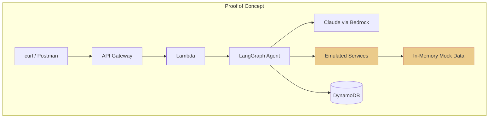

# Proof of Concept Implementation

This document describes the proof-of-concept (PoC) implementation that demonstrates key aspects of the Order Support Agent design.

---

## 1. PoC Scope

### What Was Built

| Component | Implementation | Notes |
|:----------|:---------------|:------|
| **LangGraph Agent** | Functional | Conversation flow with state management |
| **AWS Bedrock Integration** | Functional | Claude Haiku via LangChain |
| **DynamoDB Checkpointer** | Functional | Conversation state persistence |
| **FastAPI Backend** | Functional | REST endpoints for agent + services |
| **Service Layer** | Emulated | OrderService, InventoryService, PolicyService with mock data |
| **PostgreSQL** | Schema only | Tables defined, not fully populated |
| **CDK Infrastructure** | Complete | Lambda, API Gateway, DynamoDB, RDS stacks |

### What Was NOT Built (Production Requirements)

| Component | Status | Rationale |
|:----------|:-------|:----------|
| Real ERP integration | Mocked | No real ERP system available |
| Shipping API integration | Mocked | Out of scope for PoC |
| Policy RAG (OpenSearch) | Not built | PoC loads the full policy document into model context instead of vector retrieval |
| React frontend | Not started | Backend-first approach |
| Authentication | Assumed | User context passed as request param |
| Zendesk escalation | Stubbed | API call placeholder only |

---

## 2. Architecture Comparison

### Production Architecture

```mermaid
flowchart TB
    subgraph Prod["Production"]
        UI[React Portal] --> APIGW[API Gateway]
        APIGW --> ECS[Agent API (ECS Fargate)]
        ECS --> Agent[LangGraph Agent]
        Agent --> Bedrock[Claude via Bedrock]
        Agent --> Services[Python Services]
        Services --> RDS[(PostgreSQL)]
        Services --> ERP[Real ERP]
        Services --> Shipping[Real Shipping API]
        Agent --> OS[(OpenSearch<br/>Policy Vectors)]
        Agent --> DDB[(DynamoDB)]
    end
```

### PoC Architecture



**Key Differences:**
- Services use in-memory mock data instead of real databases
- No real ERP/Shipping integrations
- CLI/curl testing instead of React frontend

---

## 3. Technology Stack

### 3.1 Backend (Python)

| Package | Version | Purpose |
|:--------|:--------|:--------|
| `fastapi` | 0.115+ | REST API framework |
| `langgraph` | 0.2+ | Agent state machine |
| `langchain-aws` | 0.2+ | Bedrock integration |
| `pydantic` | 2.0+ | Data validation |
| `loguru` | 0.7+ | Structured logging |
| `uvicorn` | 0.30+ | ASGI server |

### 3.2 Infrastructure (AWS CDK)

| Stack | Resources |
|:------|:----------|
| `BackendServiceStack` | Lambda function, API Gateway |
| `DynamoDBStack` | Conversations table with TTL |
| `RDSStack` | PostgreSQL instance (schema only) |
| `IAMStack` | Execution roles, Bedrock/OpenSearch permissions |
| `Route53Stack` | DNS configuration |
| `CertificateStack` | SSL certificates |

### 3.3 AI/ML

| Service | Configuration |
|:--------|:--------------|
| **Model** | Claude Haiku 4.5 (`us.anthropic.claude-haiku-4-5-20251001-v1:0`) |
| **Region** | us-west-2 |
| **Framework** | LangGraph + LangChain |

---

## 4. Implementation Details

### 4.1 Agent Implementation

The agent is implemented as a LangGraph `StateGraph` with conversation persistence:

```python
# backend/src/agents/cx_order_support_agent.py

class CXOrderSupportAgent:
    def __init__(self, prompt_service: PromptService,
                 checkpointer: BaseCheckpointSaver):
        self.model = ChatBedrock(
            model_id="us.anthropic.claude-haiku-4-5-20251001-v1:0",
            region_name="us-west-2"
        )
        self.graph = self._build_graph()

    def _build_graph(self) -> StateGraph:
        workflow = StateGraph(AgentState)
        workflow.add_node("process", self._process_message)
        workflow.set_entry_point("process")
        workflow.set_finish_point("process")
        return workflow.compile(checkpointer=self.checkpointer)

    def process_message(self, message: str, session_id: str) -> str:
        config = {"configurable": {"thread_id": session_id}}
        result = self.graph.invoke(initial_state, config)
        return result["response"]
```

### 4.2 Service Layer (Emulated)

Services return mock data that simulates real backend behavior:

```python
# backend/src/services/order_service.py

class OrderService:
    def get_order(self, order_id: str) -> Order:
        # Returns mock order data
        return MOCK_ORDERS.get(order_id)

    def check_change_feasibility(self, order_id: str,
                                  change_type: str) -> FeasibilityResult:
        order = self.get_order(order_id)
        # Apply policy rules based on order status
        return self._evaluate_policy(order, change_type)
```

### 4.3 DynamoDB Checkpointer

Conversation state is persisted to DynamoDB for multi-turn conversations:

```python
# Uses langgraph-checkpoint-dynamodb package
from langgraph.checkpoint.dynamodb import DynamoDBSaver

checkpointer = DynamoDBSaver(
    table_name="brightthread-conversations",
    region_name="us-west-2"
)
```

---

## 5. API Endpoints

### 5.1 Agent Endpoint

```
POST /agent/chat
```

**Request:**
```json
{
  "message": "I need to change 20 mediums to large in order #1234",
  "session_id": "user-123-session-abc",
  "user_id": "user-123",
  "order_id": "order-1234"
}
```

**Response:**
```json
{
  "response": "I can help you with that. Let me check if we have 20 large shirts available...",
  "session_id": "user-123-session-abc",
  "state": "CHECK_FEASIBILITY"
}
```

### 5.2 Service Endpoints (Mock Data)

| Endpoint | Method | Description |
|:---------|:-------|:------------|
| `/orders/{id}` | GET | Get order details |
| `/orders/{id}/check-change` | POST | Check if change is allowed |
| `/orders/{id}/apply-change` | POST | Apply confirmed change |
| `/inventory/{product_id}` | GET | Check inventory levels |
| `/policies/evaluate` | POST | Evaluate policy for change type |

---

## 6. Running the PoC

### 6.1 Local Development

```bash
# Navigate to backend
cd backend

# Install dependencies
uv sync

# Set environment variables
export AWS_REGION=us-west-2
export BEDROCK_MODEL_ID=us.anthropic.claude-haiku-4-5-20251001-v1:0
export DYNAMODB_TABLE_NAME=brightthread-conversations

# Run the API server
uv run uvicorn src.main:app --reload --port 8000
```

### 6.2 Test the Agent

```bash
# Send a message to the agent
curl -X POST http://localhost:8000/agent/chat \
  -H "Content-Type: application/json" \
  -d '{
    "message": "I want to change my order",
    "session_id": "test-session-1",
    "user_id": "user-123"
  }'
```

### 6.3 Deploy to AWS

```bash
# Navigate to infrastructure
cd infrastructure

# Deploy all stacks
cdk deploy --all
```

---

## 7. What the PoC Demonstrates

### 7.1 Core Agent Capabilities

| Capability | Demonstrated |
|:-----------|:-------------|
| Natural language understanding | ✅ Via Claude |
| Multi-turn conversation | ✅ Via DynamoDB checkpointer |
| State machine flow | ✅ Via LangGraph |
| Service integration pattern | ✅ Via emulated services |

### 7.2 Infrastructure Patterns

| Pattern | Demonstrated |
|:--------|:-------------|
| Serverless deployment | ✅ Lambda + API Gateway |
| Infrastructure as Code | ✅ Python CDK |
| Conversation persistence | ✅ DynamoDB with TTL |
| LLM integration | ✅ Bedrock + LangChain |
| Policy context loading | ✅ Policy document loaded into prompt context |

### 7.3 Not Demonstrated (Future Work)

| Capability | Notes |
|:-----------|:------|
| Tool calling | Agent currently uses single-node graph |
| Real inventory checks | Would require ERP integration |
| Escalation to Zendesk | API call is stubbed |
| Frontend UI | Backend-first approach |

---

## 8. Extending the PoC

### 8.1 Adding Tools

To add tool calling (e.g., `get_order`, `check_inventory`):

```python
# Define tools
tools = [
    Tool(name="get_order", func=order_service.get_order, ...),
    Tool(name="check_inventory", func=inventory_service.check, ...),
]

# Bind to model
model_with_tools = model.bind_tools(tools)
```

### 8.2 Adding State Transitions

To implement the full state machine:

```python
workflow = StateGraph(AgentState)
workflow.add_node("greeting", greeting_node)
workflow.add_node("identify_order", identify_order_node)
workflow.add_node("check_feasibility", check_feasibility_node)
workflow.add_node("present_options", present_options_node)
# ... add transitions
workflow.add_conditional_edges("greeting", route_from_greeting)
```

### 8.3 Policy Handling (PoC)

Instead of OpenSearch-based RAG, the PoC loads the **full policy document** into the model context. This keeps the PoC self-contained, at the cost of context size and reduced scalability compared to retrieval in production.

---

## 9. Repository Structure

```
brightthread/
├── backend/
│   ├── src/
│   │   ├── agents/
│   │   │   ├── cx_order_support_agent.py   # LangGraph agent
│   │   │   ├── prompts/                    # System prompts
│   │   │   ├── services/                   # Agent-specific services
│   │   │   └── tools/                      # Tool definitions
│   │   ├── services/                       # Business logic layer
│   │   ├── repositories/                   # Data access layer
│   │   ├── routers/                        # API endpoints
│   │   ├── models/                         # Pydantic models
│   │   ├── db/                             # Database utilities
│   │   └── main.py                         # FastAPI app entry
│   └── tests/
├── infrastructure/
│   ├── app.py                              # CDK app entry
│   ├── config.py                           # Environment config
│   └── stacks/
│       ├── backend_service_stack.py        # Lambda + API Gateway
│       ├── dynamodb_stack.py               # Conversations table
│       ├── rds_stack.py                    # PostgreSQL
│       ├── iam_stack.py                    # Permissions
│       ├── certificate_stack.py            # SSL certs
│       └── route53_stack.py                # DNS
└── docs/                                   # This documentation
```
